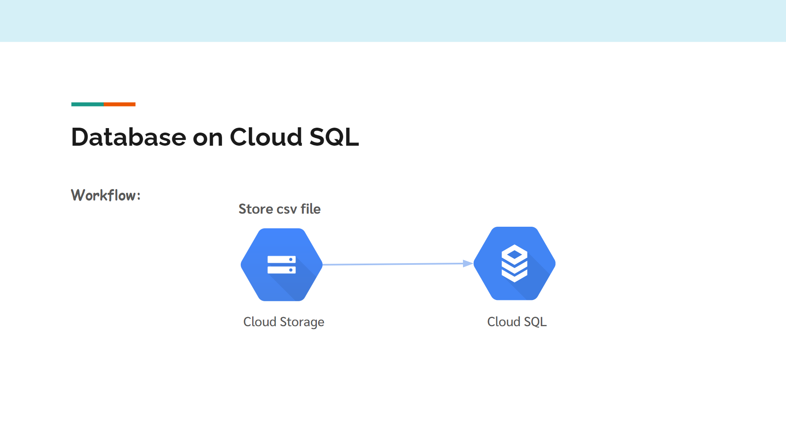
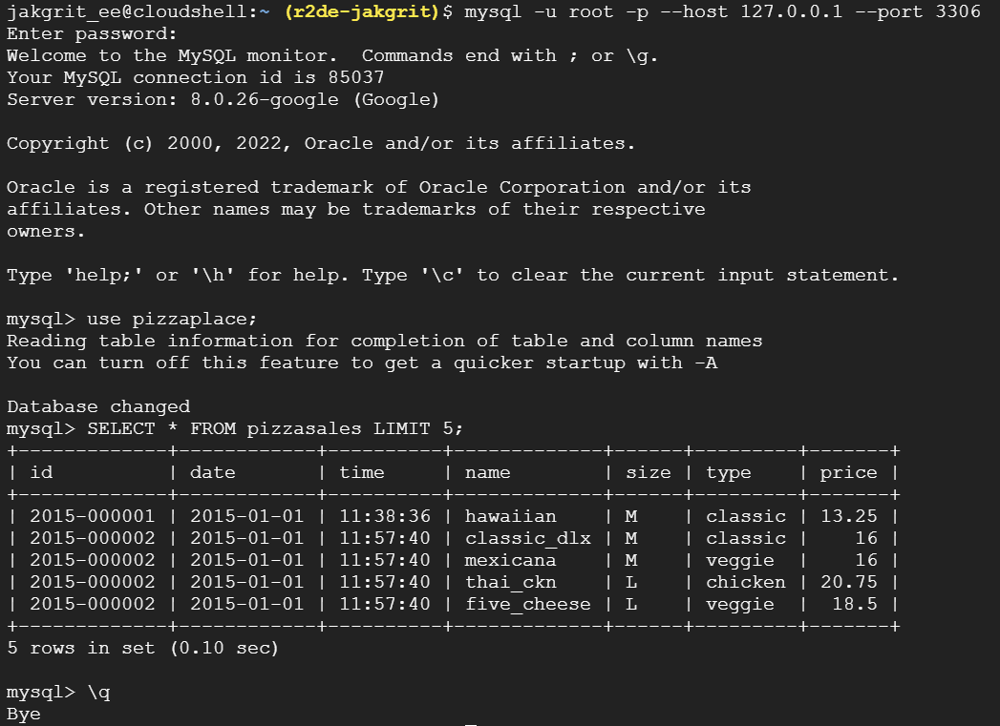

# Simple MySQL on Cloud SQL
The purpose of the project is to learn how to use Cloud SQL and connect to the database with Cloud SQL Proxy.

## Link information about dataset
https://vincentarelbundock.github.io/Rdatasets/doc/gt/pizzaplace.html  

## Workflow


## How to do this
Note: To do this you need access to a project that links to Billing Account. (There is Free Trial if you're new to Google Cloud)
<br>

**Step 1:** Get data, transform and Load to CSV file (In etl.ipynb)  

***(In Cloud Storage)***  
**Step 2:** Create bucket. [follow the official steps here](https://cloud.google.com/storage/docs/creating-buckets#create_a_new_bucket)

**Step 3:** Activate Cloud Shell and Set PROJECT_ID
```
gcloud config set project [PROJECT_ID]
```
**Step 4:** Delete header in CSV file since gcloud sql import csv does not support IGNORE 1 LINES [See Documentation](https://cloud.google.com/sdk/gcloud/reference/sql/import/csv)
```
tail -n +2 pizzaplace.csv > pizzaplace.data
```
**Step 5:** Upload pizzaplace.data file to Cloud Shell from this repo and copy it into bucket
```
gsutil cp pizzaplace.data gs://[BUCKET_NAME]
```
***(In Cloud SQL)***  
**Step 6:** Create Instance. [follow the official steps here](https://cloud.google.com/sql/docs/mysql/create-instance#create-2nd-gen)

**Step 7:** Connect to MySQL Instance 
```
gcloud sql connect [Instance_NAME] --user=root --quiet
```
<u>Tip!</u> If you can't connect you need to enable Cloud SQL Admin API. [See Documentation](https://cloud.google.com/sql/docs/mysql/connect-instance-cloud-shell)

**Step 8:** Create database and Use it
```sql
CREATE DATABASE pizzaplace;
```
```
\u pizzaplace
```
**Step 8:** Create Table and Exit MySQL
```sql
CREATE TABLE pizzasales(
    id VARCHAR(50), 
    date DATE, 
    time TIME, 
    name VARCHAR(50), 
    size CHAR(1), 
    type VARCHAR(50), 
    price DOUBLE
);
```
```
\q
```
**Step 9:** Import data to MySQL Instance
```
gcloud sql import csv INSTANCE_NAME gs://BUCKET_NAME/FILE_NAME \
--database=pizzaplace \
--table=pizzasales
```
<u>Tip!</u> If you can't import data you need to assign Storage Legacy Bucket Reader role and Storage Object Viewer role to your MySQL Instance so it can read from bucket. [See Documentation](https://cloud.google.com/sql/docs/mysql/import-export/import-export-csv#required_roles_and_permissions_for_importing)

**Step 10:** Check your result with Cloud SQL Proxy [follow the official steps here](https://cloud.google.com/sql/docs/mysql/connect-instance-auth-proxy) then run these command in new termimal tab
```
mysql -u root -p --host 127.0.0.1 --port 3306
```
```
use pizzaplace;
```
```sql
SELECT * FROM pizzasales LIMIT 5;
```

## The result should look like this
